<picture>
  <source media="(prefers-color-scheme: dark)" srcset="https://cdn.discordapp.com/emojis/862567696898195476.gif">
  <source media="(prefers-color-scheme: light)" srcset="https://cdn.discordapp.com/emojis/988833186626805771.gif">
  
</picture>

```js
Computer Science student focused on:
+ 🌐 Full-Stack Web Development  
+ 🔐 Cybersecurity (offensive + fundamentals)  
+ 🤖 Machine Learning

"Experimenting, breaking things, and learning."
```

<!-- Social Badges-->
---

[](https://github.com/rajnishanand) 
[](https://www.sololearn.com/Profile/15610625) 
[](https://dev.to/rajnishanand) 
[](https://stackoverflow.com/users/14512811/rajnish-anand)
[](https://discordapp.com/users/800445583046213663)
[](https://www.reddit.com/user/rajnishanand/)

[](https://buymeacoffee.com/rajnishanand)
[](https://ko-fi.com/rajnishanand)


<!-- [OSS Insight](https://ossinsight.io/) -->
<p align="center">
  <a href="https://next.ossinsight.io/widgets/official/compose-user-dashboard-stats?user_id=63791262" target="_blank" style="display: block" align="center">
    <picture>
      <source media="(prefers-color-scheme: dark)" srcset="https://next.ossinsight.io/widgets/official/compose-user-dashboard-stats/thumbnail.png?user_id=63791262&image_size=auto&color_scheme=dark" width="771" height="auto">
      
    </picture>
  </a>
</p>


<!-- github stats and most used langs -->
<p align="center">
  <picture>
    <source media="(prefers-color-scheme: light)" srcset="./assets/stats-light.svg">
    
  </picture>

  <picture>
    <source media="(prefers-color-scheme: light)" srcset="./assets/langs-light.svg">
    
  </picture>
</p>


<!-- git streak -->
<p align="center">
  <picture>
    <source media="(prefers-color-scheme: light)" srcset="https://github-readme-streak-stats.herokuapp.com/?user=rajnishanand&theme=icegray&hide_border=true&date_format=j%20M%5B%20Y%5D&background=00000000">
  
  </picture>
</p>

---

<details open>
<summary>
  <h3> WakaTime Stats </h3>
</summary>

<!--START_SECTION:waka-->


**🐱 My GitHub Data** 

> 📦 25.9 kB Used in GitHub's Storage 
 > 
> 🏆 31 Contributions in the Year 2026
 > 
> 💼 Opted to Hire
 > 
> 📜 21 Public Repositories 
 > 
> 🔑 12 Private Repositories 
 > 
**I'm an Early 🐤** 

```text
🌞 Morning                421 commits         █████░░░░░░░░░░░░░░░░░░░░   18.71 % 
🌆 Daytime                814 commits         █████████░░░░░░░░░░░░░░░░   36.18 % 
🌃 Evening                751 commits         ████████░░░░░░░░░░░░░░░░░   33.38 % 
🌙 Night                  264 commits         ███░░░░░░░░░░░░░░░░░░░░░░   11.73 % 
```
📅 **I'm Most Productive on Saturday** 

```text
Monday                   229 commits         ███░░░░░░░░░░░░░░░░░░░░░░   10.18 % 
Tuesday                  321 commits         ████░░░░░░░░░░░░░░░░░░░░░   14.27 % 
Wednesday                357 commits         ████░░░░░░░░░░░░░░░░░░░░░   15.87 % 
Thursday                 290 commits         ███░░░░░░░░░░░░░░░░░░░░░░   12.89 % 
Friday                   340 commits         ████░░░░░░░░░░░░░░░░░░░░░   15.11 % 
Saturday                 369 commits         ████░░░░░░░░░░░░░░░░░░░░░   16.40 % 
Sunday                   344 commits         ████░░░░░░░░░░░░░░░░░░░░░   15.29 % 
```


📊 **This Week I Spent My Time On** 

```text
🔥 Editors: 
Neovim                   4 hrs 50 mins       █████████████████████████   100.00 % 
```


 Last Updated on 15/03/2026 19:02:56 UTC
<!--END_SECTION:waka-->

</details>

<!--
<details open>
<summary>
  <h3> Github contribution Graph </h3>
</summary>
    <picture>
      <source media="(prefers-color-scheme: dark)" srcset="http://github-profile-summary-cards.vercel.app/api/cards/profile-details?username=rajnishanand&theme=github_dark" />
      
    </picture>
</details>
-->
